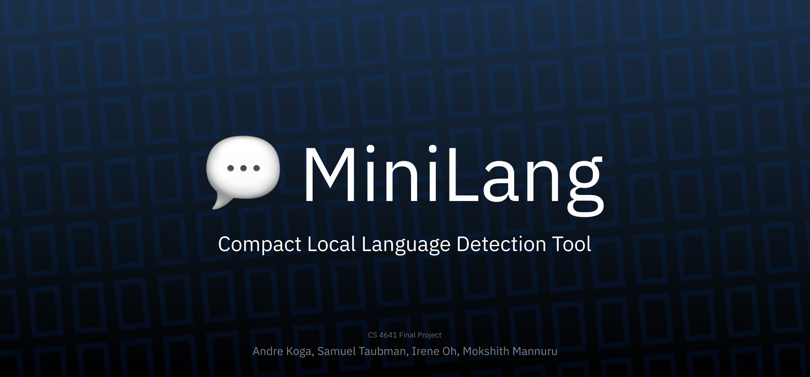

> MiniLang: Compact Local Language Detection Tool

## Project Title:
CS 4641 Final Project

## Authors:
- Koga, Andre
- Taubman, Samuel 
- Oh, Irene 
- Mannuru, Mokshith

## Description:
Compact and local tool for language detection. Uses different methods such as Naive Bayes, Transformers, Support Vector Machines, and Random Forests.
Capable of detecting sentence origin among 42 languages.

## Software:
Programmed in Python with NumPy, Pandas, Matplotlib, Transformers, and some other packages.
